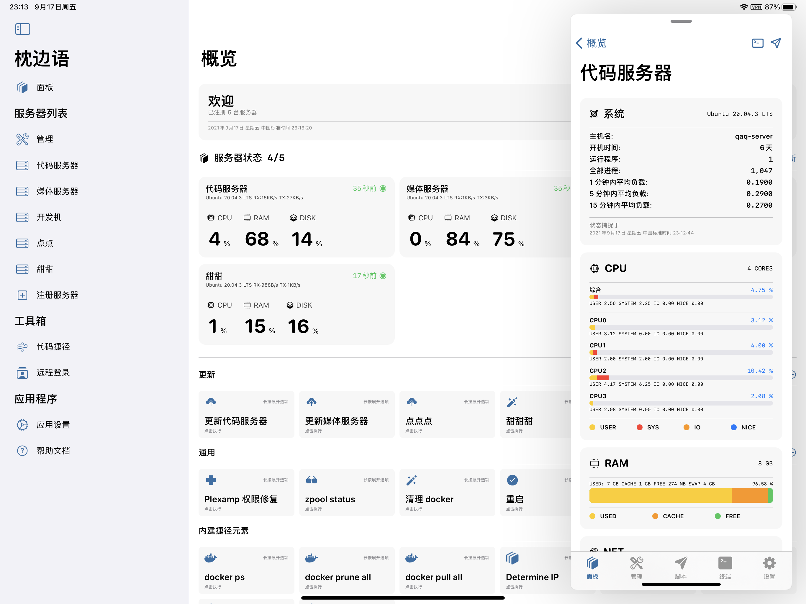

~~# PillowTalk - iOS/Lite~~
# bbtop

PillowTalk -> 枕头逼逼 -> bbtop!

An iOS & SwiftUI server monitor tool for linux based machines using remote proc file system with script execution.

## Testflight

Testflight may be canceled anytime in the future, make sure to backup your configuration file if needed. Join with [https://testflight.apple.com/join/UIW76yDz](https://testflight.apple.com/join/UIW76yDz)

## Preview

## Features

- [x] libssh2 capable Linux host connections
- [x] Authenticate with password, key, etc...
- [x] FaceID/TouchID protection
- [x] List information (cpu, ram, disk, network, etc...)
- [x] Terminal with xterm support
- [x] Code snippet with cancelable control
- [x] Transferable/Extendable configuration file
- [x] [tvOS dashboard](https://apps.apple.com/us/app/%E6%9E%95%E8%BE%B9%E8%AF%AD%E7%9C%8B%E6%9D%BF/id1565555565) available for free

## Notes

The application was initially designed as a prototype, so we chose to write the program in SwiftUI, which is a fast shaping programing language. Although the application is getting pretty well developed now, there are some bottlenecks in the development of the project due to some features of the technology selection and lack of maintenance as a prototype. We are currently designing a brand new application using UIKit. 

After some discussion, we decided to open source this prototype. This is probably because we will not be maintaining this prototype in the future. 

If you encounter any technical problems, you can ask in the issue. If the problem is not very serious we will not necessarily fix your problem, please consider fixing it yourself.

## License

[BSD 3-Clause "New" or "Revised" License](./LICENSE)

All advertising materials mentioning features or use of this software must display the following acknowledgement:

> This product includes software developed by the PillowTalk Team.

All advertising materials mentioning features or use of this software shall include link to this repository.

App icon is copyrighted, can not be used in any kind of format. 

## Contributor

- [@Lakr233](https://twitter.com/Lakr233)
- [@82Flex](https://twitter.com/82Flex)
- [@__oquery](https://twitter.com/__oquery)

---

Copyright © 2021 PillowTalk Team. All Rights Reserved.
